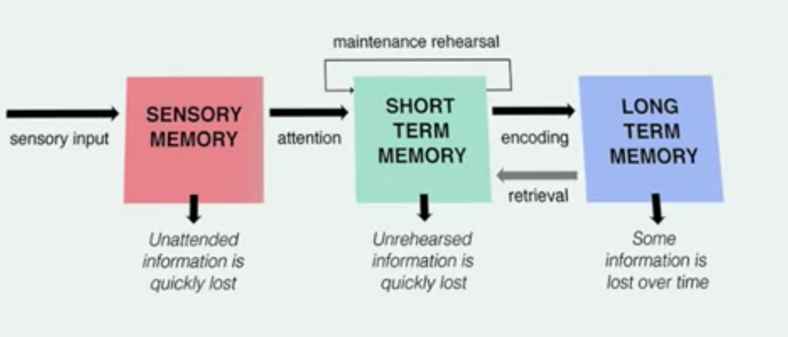

# Cognition

## Perception and Attention

Perception and attention → memory: the pair tells the story of how the world gets from the outside of our heads, finds it way inside, and stays there.

Big Themes

- Perception: the problem of perception is hard. Successful perception involves educated, unconscious guesses about the world
- Attention: We attend to some things but not others. We miss a surprising amount of what happens.
- Memory: There are many types of memory. The key is organization and understanding. You can't trust some of your memories.

### Problems of perception

Light hits the retina and the retina is a bunch of nerve cells and these nerve cells fire and they fire at some stimulus and not others. You get the equivalent of an array of numbers corresponding with the intensity of firing. The problem of perception is, out of this array of numbers, you have to extract objects and people, where people are, what they're doing,  colors , depth and so on. 

Your array is a two-dimensional array and you need to infer a three-dimensional world. It's mathematically impossible to do this with certainty. Similarly, for the world, imagine most of your retina is silent, nothing's firing, but there's neurons firing that corresponds to a shape and the shape is an irregular polygon. So, what's in the world? Well, you don't know. Think about the moon. You looking at a full moon in the sky, takes up some circular space on your eye. How do you know that it's not a foot away, or 10 feet away, or a million miles away? For everything you see, there's an indefinite number of possibilities as to the actual real-world things give rise to it.

### Perception of brightness

There's more to perceiving the brightness of an object than the amount of light that hits it. Rather, we're sensitive to the context in which the object is in. For example: Shadows make surfaces darker. So, if a surface is in shadow, we would assume that it's lighter than it looks, and we actually see it as lighter.

### Perception of object

The Gestalt psychologists proposed principles that lead us to segment one thing from another. 

**proximity:** Things that are close together relative to other things tend to be seen as distinct. 

**similarity**:  The objects gets segmented into two because there are distinct patterns. 

**closure**: 

**continuation**

**common movement**

**good form**

### Perception of depth

### Attention

Our perceptual abilities let us segment the world into objects, space into things like people, trees, houses. Understand where they stand in relationship to each other. Where they stand in depth.  This is just part of the story. The whole story is how it gets all the way from the world all the way into long-term memory. 

**Attention (Sensory memory → Short term memory)**: when you focus the spotlight of attention onto things, it causes you to remember them and think about them.  

- There are a lot of things that we don't attend to
- Sometimes attention is effortless
- Sometimes attention requires effort
- Sometimes attention is involuntary

**Sensory memory** is very short-term storage. If there's a flash of lightning, and you close your eyes and there's an after image, that's a form of sensory memory.

**Short-term memory**: what you attend to ends up in short-term memory or working memory. This is of course short-term memory that is not somehow rehearsed or understood, gets quickly lost. You can hold things in short-term memory through **maidens rehearsal**.

**Long-term memory** is storage for a long duration. 

The connection between working memory, short-term memory, and long-term memory goes both ways.

Many psychologists identify working memory with consciousness. Working memory is your experience of what things are, of how the world works. Now the most obvious way in which long-term memory and short-term memory differ is their **storage**. 

Long-term memory has virtually unlimited storage

Short-term memory in contrast has a very limited storage capacity.

- the storage of short-term memory, 7+/-2, George Miller
- chunks are basic memory units. You will get more efficient at packing information into chunks as a result of learning. So, take this example, suppose you don't know anything about French and you get the string of letters, L-A-M-A-I-S-O-N. Well, if you just try to remember each letter separately, that's eight chunks and you're pushing the limits of short-term memory. Another handy you could break it up into four English words, LA-MA-IS-ON, let's pretend la and ma are English words, now it's four chunks.
- there's a lot of evidence suggesting that people's memory gets better as they become experts. Football coaches have an excellent memory for football diagrams, architects for logical floor plans, and chess players for chess patterns. If it makes sense to you, you could glance at this and memorize it, not because your short-term memory is more powerful in general than a non-chess expert, but rather because you break this down into a single chunk. So, how much you store into your consciousness critically depends on your knowledge.

## Memory

### Important memory distinctions

- Implicit v.s. explicit
    - Explicit memory is what you consciously know; you know your name, you know the capital of Canada, you know what you had for breakfast this morning.
    - Implicit memory is what you may not be conscious of. You might, for instance, forget that you've ever been to a place, but at some level, know your way around. There may be a word that is unfamiliar to you consciously, but at gut level, you know what it means.
- semantic memory v.s. episodic memory
    - Semantic memory are facts. Again, the capital of Canada.
    - episodic memory is about episodes of your life
- encoding, storage, and retrieval.
    - Encoding is what happens to get information into your head
    - storage is keeping it in your head, and retrieval is getting out of your head.
- recall v.s. recognition
    - The recall is freely recounting what you've experienced
    - Recognition is from a set of options
- sensory memory v.a. short term memory v.s. long term memory.

### Encoding

How to get things into long-term memory

- Depth of process: the deeper you think about something, the more sense you add to it, the easier to remember
- Mnemonics: give the a word more connection. for example, a rhyme.  Memory context
- Understanding: understand the material

### Remembering

- Retrieval cues
- The compatibility principle: learn words on the boat and underwater
- Search strategies: the more you look at it from different angles, the more you can remember

### Forgetting

Why do we forget?

- Decay: Memory is a physical thing, so they decay
- Interference: similar things overlay upon previous memory
- Changes of retrieval cues : you move houses

Forgetting through brain damage

- Retrograde amnesia: loss of memories prior to stroke or accident
- Anterograde amnesia: loss of capacity to form new memory

It used to be thought that few of these amnesias simply can't form new memories. They **can't form new explicit memories.** But they **can form new implicit memories** and in particular, new skills. They learn new things, but they don't know that they learned new things. 

- Recommend movie: Memento

### False memories

How do our memories become distorted?

- Expectations:  People have done studies where they tell people stories for instance about somebody who goes to a dentist's office. And then later asked them what they remember of the story. They tend to fill in the details that typically occur even though they didn't. So the story might not mention paying the bill. But somebody later will confidently remember that they've been told a person paid the bill because they put in that fact
- Leading questions will shape how you remember a scene: If you ask them questions like, did you see the children getting into a school bus? Later on, just asking that question makes them much more likely to remember the school bus in the film. (experiment by Elizabeth Loftus)
- Hypnosis: hypnosis regression (ask people to go back to recall a crime scene for example)
- Repressed memories: wipe some unpleasant memories. debates on if that really exists
- Flashbulb memories: a dramatic event like 911, vivid memories, but not accurate. You talk about that so often and that becomes not just memory but stories.
