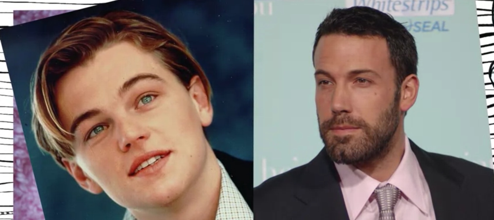

# Emotions

We put the study of emotions in a broader context and use it as a way to introduce some ideas about evolution, how it works, and why it's relevant to psychology. 

1. The foundations of modern psychology: Astonishing Hypothesis, the brain is the origin of mental life, the doctrine of physicalism
2. Darwin's Dangerous Idea: where the brain comes from,  where complex things (human, animal, plants etc.) come from
- **Argument from Design**: Quotes from theologian and doctor, William Paley: "heath, stone, watch...", human organs, the parts of our body, are just as complicated as a watch
- there's a rich parallel between biological structures and the structures made by people
- The eye is like a camera, both have lenses that bend light,  project an image onto a light-sensitive surface behind it, either the film or the retina. Both have a focusing mechanism, a diaphragm that governs the amount of incoming light. The big **difference** is, there's no such thing as a camera anywhere near as good as the human eye.
- So, Paley's view is that,  **you see something so articulately beautifully constructed, it seems to cry out for a designer**. [intelligent design] Cicero made the same argument.
    - It has huge explanatory advantages. For one thing, it really does explain where things come from, it explains it in a way we understand. Just as we know where watches come from, now we know where eyes come from.
    - Problem:
        1. appealing to a divine creator seems to push back the question
        2. Ultimately, we'll want to know where such original creatures come from. 
        3. there's long been evidence for evolution. Long been evidence as seen in fossils and vestigial characteristics like the human tailbone and goosebumps, and all of the genetic and biological evidence for the continuity of other creatures. There's a lot of room for debate over the details of evolution, but that evolution has occurred that we were not created in our current form seems reasonably indisputable. 
        4.  There's poor design. our eye has a blind spot, the male urinary system, the urethra goes through the prostate gland instead of around it. This poor design seems incompatible with benevolent, and omnipotent God.

# Why evolution matters

Two ideas come together:

1. mental life is the product of our physical brains, materialism
2. biological entities like the brain are the products of natural selection.

Brain psychology is a product of evolution.  It then becomes rational to see the mind as adapted to fulfill certain tasks:

1. perceiving the world
2. communicating with other members of our species

Misconceptions about evolution and psychology when thinking about psychology from an evolutionary point of view and here are two of them:

1. natural selection, the forces of evolutionary adaptation cause animals to want to spread their genes
    - The confusion here is the distinction between **ultimate causation** and **proximate causation**.
    - **ultimate causation**: the reason why something has evolved, and that involves a creature's history and the evolutionary course
    - **proximate causation**:  what a creature wants
    - Argument from William James
        - Feelings like hunger has to do with sustaining our body with this sort of utility we get from food
        - Psychologically, people eat because the food tastes good
    - Evolution wires up our psychology to achieve certain ends, but our psychology's typically ignorant as to evolution's goals.
2. Everything should be an adaptation, that everything we do has adaptive significance exist in order to increase the reproductive success of the animal.
    - Natural selection doesn't directly influence behaviors, rather, natural selection evolves brains and bodies. Once they come to exist, they do all sorts of things. Some are adaptive, and others are not, and this is true for instance for hiccups or lower back pain, or self-pity.
    - our brains have evolved over a period of many millions of years, largely adapted once we became humans and separated from other species, living roughly as hunter-gatherers or at least in some sort of small group without access to alcohol or television or Facebook or all of the things in modern technology.
    - We haven't adapted to live in a world with billions of people and so we might be ill-suited to do so. Some of the behaviors we do may actually be to our detriment today.

One interesting evolution psychology topic: which mental traits, behaviors, desires are adaptions, which of them are accidents.

- Adaptions: color vision, most of our perceptual system, language (people are debating about this), sexual desire (but pornography exploits it)
- Non-adaption: love of television, chocolate
- Hard cases that nobody knows why it evolved: pleasure from art or music, female orgasm, humor, sexual violence, xenophobia [ˌzenəˈfoʊbiə]

- Why does poop smell bad?
- Why does chocolate taste good?
- Why do we love our children for the most part?
- Why do we get angry when people hit us?
- Why don't we feel good when somebody does us a favor?

As psychologists, we're going to use the tools of evolutionary theory to step back and explore the nature and origins of the most intimate aspects of ourselves including our emotions. 

- Life is impossible without emotions
    - our emotions are shaped by cultural contexts. Depending on who you are and where you live, your emotions will be different, they'll respond to different things.
    - But just as we'd expect from an evolutionary perspective, they have universal roots. There are aspects of emotions that all of us share

# Facial expressions

Facial expressions were a great source of interested to Charles Darwin.

theory → facial expressions

New Delhi in 1965, pre-literate

Smiles are social signals

there are different types of smiles

- Happiness smile (aka Duchenne smile)
- Greeting smile
- Coy mile:  I am adorable and please don't hurt me.

## Fear

What are people afraid of? Why are we afraid of shakes and spiders? Evolution has primed us to fear something but not the others.

if emotions are signals, they evolved to be trustworthy signals. They've evolved to be signals of a sort that other people could take account of, and why is that signals would evolve? Is actually a very interesting question.

## Kinship

A puzzle for evolution: emotions that incline us to be kind to others, like compassion and gratitude and so on. 

- we know it's a problem because we know there is altruism.
    - animals care for their young, they groom each other.
        - Vampire bats suck up the blood of some animal like a horse and consume some of it themselves, but then come back and regurgitate it into the mouths of their little vampire bat pups.
    - Richard Dawkins: "We are evolved altruists, but we're not indiscriminate altruists." A better way of putting it is **animals are the vehicles that contain genes**. And the genes are the replicators.  **An animal is merely the gene's way of making another gene.**

## Attachment

Animals have evolved to be nice to kin. 

- **Birds and mammals** v.s. **fish and reptiles**:  Birds and mammals invest in quality, not quantity. We have relatively few offspring so, it's important that we take care of them and that they survive.
- A long period of dependence prior to sexual maturity. We have slowed down our course of growth and this is a **biological adaption**. We spend time learning and adapting to our environment before being separate and distinct agents.
- Two separate psychological stories
    1. How parents respond to children (parent's attachment to child)
        - we are wired up to respond to their distress calls which would be like crying in humans,
        - we're wired up to find them cute
        - We tend to think of adults with baby faces (Leonardo DiCaprio, left) more as naive, and helpless, kind, and warm. Even though we can tell that they're not really younger. We don't think of adults with male testosterone face (Ben Affleck, right) the same way.

            

    2. How children respond to parents (child's attachment to parent)
        - attach to whoever's closest, whoever takes care of them
        - a young baby will typically prefer the voice, and face, and smell of the mother
        - when the baby can explore to cuddle around, it will come back to the mother
        - What's the psychological mechanism underlying that?
            1. cupboard theory (BF Skinner): the mother is rewarding
            2. innate tendency (Bowlby): there are two forces. One is a positive force. Babies are drawn to her mother for comfort and social interaction and physical warmth.  There is a negative force.  A fear of strangers drives babies away from individuals who aren't familiar with who they aren't attached.

## Prisoner's dilemma

Animals are nice to non-kin (like friends)

- Reciprocal altruism (Trivers): if you scratch my back, I will scratch yours
    - Problem of cheating: the reciprocal altruism appears to be untenable.
- Reciprocal altruism can evolves if animals can punish theaters. They need to 1) recognize cheaters 2) remember them 3) be motivated to punish
- Prisoners dilemma
    - no solution for one game
    - what if you can play the game over and over? Tit-for-tat
        - The first time cooperate
        - After that, do on each trial what the other did on the previous trial
- We feel **gratitude** and **liking** for people who cooperate with us. This motivates us to be nice to them in the future.
- We feel **anger** and **distrust** toward those who betray us. This motivates us to betray or avoid them in the future.
- We feel **guilt** when we betray someone who cooperates with us. This motivates us to behave better in the future.

## Irrationality and culture

Sometimes our emotions guide us to act in ways that are, in some formal sense, irrational. But in a practical sense, are actually beneficial.

- The ultimatum game
- There is a social usefulness of irrationality, of being emotional.
    - A **rational person** is easily **exploited** because their response to provocations and assault will always be appropriate.
    - A person with a **temper** has an advantage: "mess with me and I will kill you"
    - If a person is too prone to provocation, you won't deal with them at all.

- The importance of **reputation** depends on the culture
    - Sociologists describe "a culture of honor":
        1. can't rely on the law
        2. resources are easily taken, like herders
        3. reputation for excessive violent retaliation is essential to keep your resources. 

    Some examples:

    Scottish highlanders

    Masai warriors

    Bedouin tribesmen

    Western cowboys

    American South

    - the culture of honor manifest itself in all sorts of psychological differences. Between individuals within such a culture and outside such a culture.
        - People who are raised within cultures of honor in the US have more permissive gun laws, corporal punishment and capital punishment, attitudes toward the military, more forgiving towards crimes of honor, higher rate of violence but in certain circumstances (like bar fights because of insults of one's honor).
        - A study of honor as a psychological phenomenon (students from the south and north), greater levels of testosterone, cortisol, stress hormones, stronger handshake, more violent words when asked to fill in the blank.
    - Emotions are not noise in the system. They are complex motivational systems evolved to solve problems, sensitive to the culture. Exquisitely crafted to deal with these natural and social environments that we live in.
