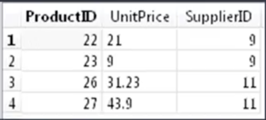
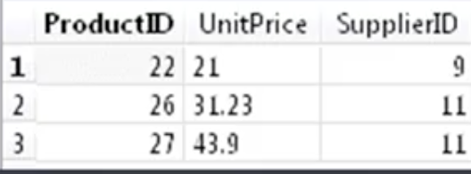

# Filtering, Sorting, and Calculating Data with SQL

## Filter

### `WHERE`
<!-- Summary
Now that you've began writing your first SQL statements, you're probably really starting to see just how much data you can pull down from databases. So far what you've been experimenting with only has been a few thousand records, but many databases have a lot more data in them. Someday you might work with databases with the millions or even tens of millions of records in it. It almost boggles the mind, right? Well clearly, we're never going to want to look at all of that data at once. So thankfully, SQL gives us several methods to pair down and sort our data so we can quickly get the results we want. That's what we're going to discuss in this module. I'm going to introduce you to several methods for filtering data. At the end of this module, you'll know how to use several more clauses and operators including WHERE, BETWEEN, IN, OR, NOT, LIKE, ORDER BY, and GROUP BY. In addition, I'm going to tell you about wildcards which allow us to search for more specific or parts of record, including their disadvantages and advantages, and how we can best use these wildcards. We'll also discuss how to use some basic math operators as well as aggregate functions like, AVERAGE, COUNT, MIN, and MAX. And we'll start to begin analyzing our data. Obviously, this module's jam packed with new information. So let's not waste any more time, and go ahead and get started. -->

**Learning Objectives**

- Describe the basics of filtering your data
- Use the `WHERE` clause with common operators
- Use `BETWEEN` clause
- Explain the concept of a `NULL` value

Filtering allows us to narrow the data we want to retrieve. Filtering is also used when you're doing analysis to get very specific about the data you want to analyze as part of your model. To do this we use what's called the `WHERE` clause. And the `WHERE` clause comes after `SELECT` and `FROM`

```sql
SELECT column_name, column_name
FROM table_name
WHERE column_name operator value;
```
Here is a table of common operators:

|Operator | Description |
|---------|-------------|
| `=`| Equal |
| `<>` | Not equal. Note: In some versions of SQL this operator may be written as `!=`|
| `>` | Greater than |
|`<` | Less than |
| `>=` | Greater than or equal |
| `<=` | Less than or equal |
| BETWEEN | Between an inclusive range |
| IS NULL | Is a null value |

Let's look at some examples.

```sql
SELECT ProductName,
UnitPrice,
SupplierID
FROM Products
WHERE ProductName = 'Tofu';
```

In the above example, we filter on a single condition. We look at  ProductName, UnitPrice and SupplierID for tofu. You can similarly look at products whose prices are greater than or equal to 75. 

```sql
SELECT ProductName,
UnitPrice,
SupplierID
FROM Products
WHERE UnitPrice >= 75;
```

Or you can filter out all records except one value:

```sql
SELECT ProductName,
UnitPrice,
SupplierID
FROM Products
WHERE ProductName <> 'Tofu';
```

You can filter for a range of values:

```sql
SELECT ProductName,
Unitprice,
SupplierID,
UnitsInStock,
FROM Products
WHERE UnitsInStock BETWEEN 15 AND 80;
```

You can filter `NULL` values by `IS NULL`

```sql
SELECT ProductName,
UnitPrice,
SupplierID,
UnitsInStock
FROM Products
WHERE ProductName IS NULL;
```

### `IN`, `OR` and `NOT`

**Learning Objectives**

- Use the `IN` and `OR` operators to filter your data and get results you want
- Differentiate between use of the `IN` and `BETWEEN` operators
- Discuss importance of order of operations
- Explain how and when to use the `NOT` operator

Let's start from`IN`. To use the IN operator, we need to specify a range of conditions or a set of values.

```sql
SELECT
ProductID,
UnitPrice,
SupplierID
FROM Products
WHERE SupplierID IN (9, 10, 11);
```

Another operator is the `OR` operator. An important thing to know about this is that a database management system will not evaluate the second condition in a `WHERE` clause if the first condition is met. 

```sql
SELECT
ProductName,
ProductID,
UnitPrice,
SupplierID,
ProductName
FROM Products
WHERE ProductName = 'Tofu' OR 'Konbu';
```

You can use `OR` with `AND`. There is somthing you need to pay extra attention. Look at the following two examples:

- Example1:

```sql
SELECT
ProductID,
UnitPrice,
SupplierID,
FROM Products
WHERE SupplierID = 9 OR
SupplierID = 11
AND UnitPrice > 15;
```

{width=40%}

- Example2:

```sql
SELECT
ProductID,
UnitPrice,
SupplierID
FROM Products
WHERE (SupplierID = 9 OR
SupplierID = 11)
AND UnitPrice > 15;
```
{width=40%}

Since SQL processes the `OR` before the `AND`, in example1, SQL will stop after processing `OR`, so it won't even get to the operation after `AND`. In order to solve that, you need to use parentheses.

Even you don't have to use a parenthesis, but it's always really recommended. This way you're not relying on the default order of operations.

You can use `NOT` to get the supplementary part:

```sql
SELECT *
FROM Employees
WHERE NOT City='London' AND
NOT City='Seattle';
```

**Wildcards**

Have you ever come across data where you knew either the beginning or end of something, but didn't know the rest of it? Or maybe you know that something is like something else, but slightly different. In the rest of this section, we are going to discuss the use of the wildcards and the `LIKE` operator. You will learn the concept of wildcards, including their advantages and disadvantages.

Wildcard is a really powerful especially for string values or text data. A wildcard is a special character used to match parts of a value. You search for a pattern of string. `LIKE` works for both string and numerical variables. But wildcards cannot be used for numerical data. 

**`%` Wildcards**

| Wildcard | Action |
|----------|--------|
| `%carrot` | Grab anything ending with the word `carrot` |
| `carrot%` | Grab anything after the word  `carrot` |
| `%carrot%` | Grab anything containing the word `carrot` |
| `today%happy` | Grab anything that starts with `today` and ends with `happy`|
|`t%@gmail.com` | Grab gmail address that start with `t`|

Underscore(`_`) wildcard matches a single character but it is not supported by DB2.

```sql
WHERE size LIKE `_carrot`
```

Output:

```pre
lcarrot
mcarrot
scarrot
```

It is identical with: 

```sql
WHERE size LIKE `%carrot`
```

Bracket (`[]`) wildcard specifies a set of characters in a specific location. It does not work with all DBMS. It does not work with SQLite.

There are some downsides to using wildcards:

- Takes longer to run
- Better to use another operator (if possible) `=`,`<`,`>=` etc.
- Depending on the system
- Hard to read

## Sort

**Learning Objectives**

- Explain some of the rules related to using the `ORDER BY` clause
- Use the `ORDER BY` clause to sort data either in ascending or descending order

`ORDER BY` allows us to sort data by particular columns. Now there are a few rules when using `ORDER BY`:

1. It can take multiple column names.
2. If you're doing multiple columns, you just want to make sure you're adding a comma after that. 
3. You can sort by a column that you didn't retrieve. 
4. It must always be the last clause in the select statement. 

You can sort by column position. For example, sort by column 2 and 3:

```sql
ORDER BY 2,3
```

There are also some directions as with any type of sorting, either in ascending, `ASC`, or descending order, `DESC`. This is only applied to the column name it directly proceeds. If you're using order by descending and have unit price, it's not going to do it for all of columns after the `DESC`. You have to specify each individual columns for ascending and descending, if you want it that way.

## Math Operations

**Learning Objectives**

- perform basic math calculations 
- discuss in more detail the concept and the order of operations
- describe what can be done in terms of analysis by using math operators and SQL with math calculations

Let's start with some simple ones. We have the addition, subtraction, multiplication, and division. 

```sql
SELECT 
ProductID,
UnitsOnOrder,
UnitPrice,
UnitsOnOrder * UnitPrice AS Total_Order_Cost
FROM Products
```

In this example, we get the total order cost by multiplying units on order with unit price. And then, we name the new column `Total_Order_Cost` by using `AS`. 

You dont't have to `SELECT` the unit price and the units on the order to calculate the total cost. You could have just selected the product ID and then calculated the new field. But it is a nice thing to make sure it all adds up and looks right. 

Now let's add these operators together. Just as any math you're doing, it's going to follow normal order of operations. You probably remember the order of operations from past math classes. Operations in parentheses are handled first, then power, multiplication, division, addition, and subtraction. 

```sql
SELECT
ProductID,
Quantity,
UnitPrice,
Discount,
(UnitPrice - Discount)/Quantity AS Total_Cost
FROM Products
```

## Aggregrate Functions

**Learning Objectives**

- Describe various aggregate functions
- Use various aggregate functions: `AVERAGE`, `COUNT`, `MIN`, `MAX` and `SUM` to summarize and analyze data
- Describe the `DISTINCT` function

Aggregate functions are used for various things such as finding the highest or lowest values, total number of records, average value, etc. We're going to use a lot of these different types of aggregate functions to get descriptive statistics. The aggregate functions we can use are `AVG`, `COUNT`, `MIN`, `MAX`, and `SUM` and all of these are pretty self explanatory. 

| Function | Description |
|----------|-------------|
| `AVG()` | Averages a column of values |
| `COUNT()` | Counts the number of values |
| `MIN()` | Finds the minimum value |
| `MAX()` | Finds the maximum value |
| `SUM()` | Sums the column values |

- `AVG()`

```sql
SELECT AVG(UnitPrice) AS avg_price
FROM Products;
```

- `COUNT(*)`: Counts all the rows in a table containing `NULL` values

```sql
SELECT COUNT(*) AS total_customers
FROM Customers;
```

- `COUNT(column)`: Counts all the rows in a specific column ignoring `NULL` values

```sql
SELECT COUNT(CustomerID) AS total_customers
FROM Customers;
```

- `SUM()`

```sql
SELECT SUM(UnitPrice*UnitsInStock) AS total_price
FROM Products
WHERE SupplierID = 23;
```

One important thing to use with aggregate functions is the word `DISTINCT`.  If the word `DISTINCT` isn't specific in a statement, SQL will always assume you want all the data. For example, you may have a customer who's in a table multiple times. If you're counting customer IDs, you may count duplicate records in there. And this is really helpful to run queries where you're counting distinct and to see if there are duplicates in a column. There are some things to keep in mind when using `DISTINCT` with our aggregate function of `COUNT` You can't use `DISTINCT` on the `COUNT(*)`.

```sql
SELECT COUNT(DISTINCT CustomerID)
FROM Customers;
```

## Group Data

**Learning Objectives**

- perform additional aggregations using `GROUP BY` and `HAVING` clause
- discuss how `NULL`s are or aren't affected by the `GROUP BY` and `HAVING` clauses
- use the `GROUP BY` and `ORDER BY` clauses together to better sort your data

A lot of times, we'll be looking at the average price for different types of products, or total perchasing for different customer segments. Then we need to aggregate data by groups.  In this example, assume we want to know the number of customers we have by each region. 

```sql
SELECT Region, COUNT(CustomerID) AS total_customers
FROM Customers
GROUP BY Region;
```

If we were to just have our `SELECT` statement with `Region, COUNT(CustomerID) AS total_customers`, but without specifying the variable to `GROUP BY`, we're going to get an error return. Because the computer doesn't know how to count the customer IDs. So we put the `GROUP BY` clause in the end. There are three things to pay attention:

1. `GROUP BY` clauses can contain multiple columns. 
2. Every column in your `SELECT` statement must be present in a `GROUP BY` clause, except for aggregated calculations. 
3. `NULL`s will be grouped together if your `GROUP BY` column contains `NULL`s.

`HAVING` clause works for groups. But `WHERE` filters on rows not groups.

```sql
SELECT CustomerID, COUNT (*) AS orders
FROM Orders
GROUP BY CustomerID
HAVING COUNT (*) >=2;
```

To sum up, `WHERE` filters before the data is grouped and then `HAVING` filters after the data is grouped. Rows eliminated by the `WHERE` clause will not be included in the `GROUP BY` clause. It is important to know when you should use `WHERE` versus `HAVING`. 

Another thing to note about `GROUP BY` is that it's always a good practice to use the `ORDER BY` clause. The `GROUP BY` does not sort the data in any fashion. It only groups it together. In our previous examples, we have a list of states, a list of regions. It's not going to sort those regions in alphabetical order. It's just going to group them by different regions. It is recommended to use `ORDER BY` in this situation. It makes the results a little easier to read.

```sql
SELECT SupplierID, COUNT(*) AS Num_Prod
FROM Products
WHERE UnitPrice >= 4
GROUP BY SupplierID
HAVING COUNT (*) >= 2;
```

## Summary

Here is a table of key SQL clauses in order:

| Clause | Description | Required |
|--------|-------------|----------|
| `SELECT` | Columns or expressions to be returned | Yes |
| `FROM` | Table from which to retrieve data | Only if selecting data from a table |
| `WHERE` | Row-level filtering | No |
| `GROUP BY` | Group specification | Only if calculating aggregates by group |
| `HAVING` | Group-level filter | No |
| `ORDER BY` | Output sort order | No |

**SQL for various data science languages**

- SQL for R (You should really learn `dplyr`......the package here is just FYI)
    - [SQLDF Package](https://cran.r-project.org/web/packages/sqldf/index.html)
    - [Documentation](https://cran.r-project.org/web/packages/sqldf/sqldf.pdf)
    - [Examples](https://www.r-bloggers.com/manipulating-data-frames-using-sqldf-a-brief-overview/)
    
- SQL for Spark
    - [Documentation](https://spark.apache.org/docs/latest/sql-programming-guide.html#overview)

- SQL with Hadoop
    - [Hive Overview](https://hive.apache.org)
    - [Documentation](https://cwiki.apache.org/confluence/display/Hive/LanguageManual)

- SQL for Python
    - [Python-SQL Package Documentation](https://pypi.python.org/pypi/python-sql)