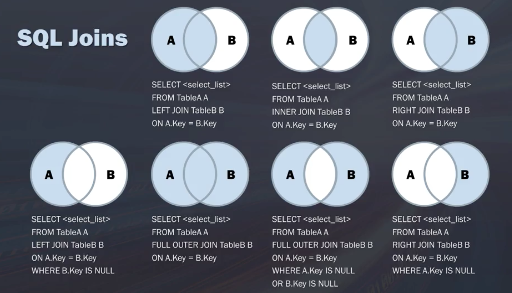

# Subqueries and Joins 

## Subqueries

- Define subqueries
- Discuss advantages and disadvantages of using subqueries
- Explain how subqueries help us merge data from two or more tables
- Write more efficient subqueries

Subqueries are queries embedded into other queries. Since data is stored in multiple tables, you may need to get information from multiple sources. Data scientists often use subqueries to: 

- Select specific records or columns and then use the criteria as filtering criteria for the next thing they want to select.
- Add additional criteria like filtering criteria that are not in your current table from another table into your query. 

Example: Need to know the region each customer is from who has had an order with freight over 100. The freight information is in table `Orders` and the customer information is in table `Customers`.

```sql
SELECT customerID, CompanyName, Region
FROM Customers
WHERE customerID in (SELECT customerID FROM Orders WHERE Freight > 100);
```

DBMS is performing two operations:

1. Get the customer ID for the orders selected
2. Pass that to the `WHERE` clause and processing the overall `SELECT` statement

**Note that it always perform the innermost `SELECT` portion first. **

- **Best Practices and Considerations**
    - There is no limit to the number of subqueries you can have
    - Performance slows when you nest too deeply. 
    - Subquery selects can only retrieve a single column

Also, when you use subqueries, the code gets harder to understand. One of the best practices for writing subqueries is to be clear and consistent with indenting to make it easier to read. This website will pre-format SQL code for you: www.poorsql.com


Subqueries can also be used as calculations. 

Example: Get the total number of orders by each customer

```sql
SELECT customer_name,
    customer_state (SELECT COUNT(*) AS orders FROM Orders WHERE 
        Orders.customer_id = Customer.customer_id) AS orders
FROM customers
ORDER BY Customer_name
```

As you can see, we're selecting customer name, the region and then just as if we were going to select a different column name we have a whole subquery in there. 
We have `(SELECT COUNT(*) AS orders FROM Orders`, and count these based on the customer IDs.  It's aggregating the orders based on the customer IDs ( `Orders.customer_id = Customer.customer_id`). In the end, we order the table by customer name.

## Joins

Benefits of breaking data into tables:

- Efficient storage
- Easier manipulation
- Greater scalability
- Logically models a process
- Tables are linked by common values (keys)

Joins associate corrects from each table and allow data retrieval from multiple tables in one query. Note that joins are not physical. They persist for the duration of the query execution. 

- Cartesian (cross) joins: each row from the first table joins with all the rows of another table

If table 1 has $n_1$ rows and table 2 has $n_2$ rows, then after cartesian join, the resulted table will have $n_1 \times n_2$ rows. It is not frequently used and is computationally taxing.

Example: 
- Table 1: vendor_name
- Table 2: product_name, product_price 

```sql
SELECT vender_name, product_name, product_price
FROM Vendors, Products
WHERE Vendors.vendor_id = Products.vendor_id;
```

It does not match anything. It's just multiplying what you had in the first table with those records in the second table. 

- **INNER JOIN** selects records that have matching values in both tables

It is one of the most frequently used joins in SQL. 

Example:

```sql
SELECT suppliers.CompanyName, ProductName, UnitPrice
FROM Suppliers INNER JOIN Products 
ON Suppliers.supplierid = Products.supplierid
```

Inner join syntax:

- Join type is specified (INNER JOIN)
- Join condition is in the FROM clause and uses the On clause
- Joining more tables together affects overall database performance
- You can join multiple tables, no limit
-  List all the tables, then define conditions

Example:

```sql
SELECT o.OrderID, c.CompanyName, e.LastName
FROM ( (Orders o INNER JOIN Customer c ON o.CustomerID = c.CustomerID)
INNER JOIN Employees e ON o.EmployeeID = e.EmployeeID
);
```

Be careful about the names and make sure you don't make unnecessary joins.

Aliases and self-joins

SQL aliases give a table or column a temporary name. It can make column names more readable. An alias only exists for the duration of the query.

- WITHOUT alias

```sql
SELECT vendor_name, product_name, product_price
FROM Vendors, Products
WHERE Vendors.vendor_id = Products.vendor_id;
```

- WITH alias

```sql
SELECT vendor_name, product_name, product_price
FROM Vendors AS v, Products AS p
WHERE v.vendor_id = p.vendor_id;
```

Self-join is to join table to itself. For example, assume you want to match customers from the same city. You can take the table and treat it like two separate tables. Join the original table to itself. 

```sql
SELECT column_name(s)
FROM table1 T1, table2 T2 
WHERE condition;
```

```sql
SELECT A.CustomerName AS CustomerName1, B.CustomerName AS CustomerName2, A.City
FROM Customers A, Customers B
WHERE A.CustomerID = B.CustomerID
AND A.City = B.City
ORDER BY A.City;
```

- Left/Right/Full outer joins

**LEFT JOIN** returns all rows from the left table, even if there are no matches in the right table. **RIGHT JOIN** returns all rows from the right table. **FULL JOIN** returns rows in either table. 

- Union

The **UNION** operator is used to combine the result-set of two or more SELECT statements. Each SELECT statement within UNION must have the same number of columns. Columns must have similar data types. The columns in each SELECT statement must be in the same order. 

Example:

```sql
SELECT column_name(s) FROM
table1
UNION
SELECT column_name(s) FROM
table2;
```

- **Best Practices**
    - Check the number of records
    - Does it seem logical given the kind of join you are performing?
    - Check for duplicates
    - Check the number of records each time you make a new join
    - Are you getting the expected results?
    - Start small: one table at a time
    - Think about what you are trying to do and map how you are joining data tables first
    - Use a join condition

- Summary Diagram

{width=80%}

- Further Reading
    - [Thinking in SQL vs Thinking in Python](https://blog.modeanalytics.com/learning-python-sql/)
    - [Difference Between Union and Union All - Optimal Performance Comparison](https://blog.sqlauthority.com/2009/03/11/sql-server-difference-between-union-vs-union-all-optimal-performance-comparison/)

